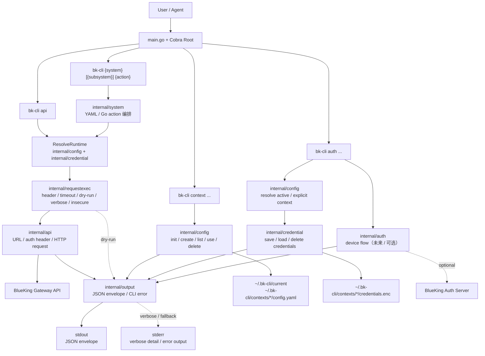

# bk-cli 设计文档

## 1. 文档定位

本文档是 bk-cli 的统一设计说明，面向两类读者：

- 开发者：需要理解项目分层、模块职责、扩展方式、测试约束和演进边界。
- Agent：需要快速判断命令应如何实现、输出应遵循什么契约、在哪一层扩展，以及如何避免破坏自动化兼容性。

如果 `README.md`、`AGENTS.md` 与本文档存在表达差异，应优先以本文档作为当前实现层面的设计基线，再结合测试与当前实现核对真实行为。

## 2. 架构速览

```text

  ┌────────────────────────────────────────────┐
  │ 快捷指令（未来）                              │  // L3:   bk-cli demo +create
  ├────────────────────────────────────────────┤
  │ 系统子命令                                   │  // L2:   bk-cli {system} [{subsystem}] action [--args]
  │ （YAML 定义或 Go 编码）                       │  // L1.5: bk-cli devops pipeline get_build_list
  ├────────────────────────────────────────────┤
  │ 原始 API 层                                 │  // L1:   bk-cli api bk-iam GET /path
  │ （HTTP 客户端、URL 构造器、认证头）             │
  ├────────────────────────────────────────────┤
  │ 基础层                                      │  // L0:   config, credential, output
  │ （上下文、加密、JSON 信封）                    │
  └────────────────────────────────────────────┘
```

每一层只能依赖其下层。不存在循环依赖。


## 3. 项目目标与设计原则

bk-cli 是一个用于与 BlueKing 平台 API 交互的 Go CLI。它不是面向"手工操作优先"的命令行工具，而是面向 Agent、自动化流程、脚本管道和可编排执行环境设计的 CLI。

设计原则如下：

1. **Agent-First Design**
   所有命令都优先保证结构化输出、稳定错误模型、明确退出码、可 dry-run、可被脚本安全消费。

2. **Bottom-Up Architecture**
   底层能力先于命令层实现，所有高层命令都建立在统一的配置、凭据、HTTP、输出契约之上，避免横向复制逻辑。

3. **CLI Excellence**
   命令应具备清晰的参数命名、带真实示例的 `--help`、可预测行为，以及 stdout/stderr 分离。

4. **Extensibility by Default**
   常见系统动作应能通过 YAML 扩展；复杂动作应能通过 Go 扩展，但二者必须共享统一的调用和输出语义。

5. **Testability and Isolation**
   所有核心行为都应在边界处可测试，尤其是配置加载、凭据读写、请求构造、响应封装、上下文切换和 system action 注册。

## 4. 总体分层与依赖方向

bk-cli 采用明确的单向依赖分层：

```text
internal/*   -> 核心能力层，禁止导入 cmd/*
cmd/*        -> Cobra 命令层，负责参数与调用编排
main.go      -> 程序入口，负责执行与退出码
```

从功能视角，系统可以理解为四层：

```text
快捷层（未来）
  例：bk-cli demo +create

系统命令层
  例：bk-cli apigateway list_gateways
  例：bk-cli devops pipeline get_build_list
  来源：YAML 定义 action 或 Go-implemented action

原始 API 层
  例：bk-cli api bk-iam GET /path
  能力：URL 构造、请求构建、认证头、响应封装

基础层
  能力：context、config、credential、output
```

如果想从"命令执行过程"而不是"静态分层"理解 CLI，可以看下面这张流转图。它强调四类命令在当前实现中的主路径，以及它们最终如何落到本地状态、远端 API 和统一输出契约上。



快速理解这张图时，可以抓住三个重点：

- `bk-cli api` 和 `bk-cli {system} [{subsystem}] {action}` 最终会汇合到同一条请求执行链路：`ResolveRuntime -> internal/requestexec -> internal/api -> internal/output`。
- `bk-cli context` 只管理本地上下文状态，主要落到 `current` 和各个 context 目录下的 `config.yaml`。
- `bk-cli auth` 先定位 context，再管理 `credentials.enc`；未来如果补全设备码流程，还会额外经过 `internal/auth` 与认证服务交互。

分层约束：

- 基础层负责"所有命令共享的稳定能力"。
- 原始 API 层只关心把一次 HTTP 请求可靠地构造、发送并封装输出。
- 系统命令层把高层语义映射到原始 API 调用，避免每个业务命令重复处理参数拼装。
- 快捷层是未来更高层的任务化入口，目前仅保留设计位置，不作为当前实现边界的一部分。

这套分层的核心价值在于：新增命令时，开发者首先需要判断自己是在扩展共享能力、扩展原始 API、扩展 system action，还是新增更高层语义。判断正确，代码自然会落在正确目录里。

## 5. 核心模块职责

### 5.1 `internal/config`

负责配置和上下文管理，是所有命令的环境基座。

职责包括：

- 定义配置结构体。
- 读写 `config.yaml`。
- 管理当前 active context。
- 支持 `BK_CLI_CONFIG_DIR` 覆盖默认配置目录。
- 校验 `bk_api_url_tmpl` 是否合法且包含 `{gateway_name}`。
- 校验 context 名称必须是单段安全名称，匹配 `^[a-z][a-z0-9-]*$`。

典型数据位置：

```text
~/.bk-cli/
├── current
└── contexts/
    ├── default/
    │   ├── config.yaml
    │   └── credentials.enc
    └── clouds/
        ├── config.yaml
        └── credentials.enc
```

其中：

- `current` 保存当前激活的 context 名称。
- `contexts/{name}/config.yaml` 保存该部署的 URL 模板、认证地址、tenant 等配置。
- context 名称必须是单段安全名称，匹配 `^[a-z][a-z0-9-]*$`；不允许路径分隔符、`.`、`..`、大写字母或 `_`。
- 首次使用必须显式执行 `bk-cli context init --bk_api_url_tmpl=...` 创建 `default` context；系统不会再隐式生成带占位默认值的 context。

### 5.2 `internal/credential`

负责凭据模型、序列化和加密存储。

职责包括：

- 定义不同凭据类型。
- 校验凭据字段组合是否合法。
- 使用 AES-256-GCM 加密和解密。
- 在每个 context 下读写 `credentials.enc`。

支持的凭据模式：

1. `app_user + bk_token`
2. `app_user + bk_ticket`
3. `access_token`

加密设计目标不是"替代操作系统钥匙串"，而是在单二进制、零运行时依赖的约束下，避免凭据明文落盘。

### 5.3 `internal/api`

负责原始 HTTP 交互能力，是 `bk-cli api` 与 system action 的共同底座。

职责包括：

- 根据 `bk_api_url_tmpl`、`gateway_name`、`stage` 和 `path` 构造最终 URL。
- 构造 `X-Bkapi-Authorization` 认证头。
- 注入 `X-Bk-Tenant-Id` 等上下文相关请求头。
- 处理 `--path`（路径占位符替换）、`--query`（查询参数）、`--body`（请求体）、额外 header。
- 解析 HTTP 响应并转为统一 envelope。

这一层不关心具体业务动作名称，只关心如何可靠发起一次 BlueKing 网关请求。

### 5.4 `internal/output`

负责 bk-cli 最核心的对外交互契约：统一输出与错误输出。

职责包括：

- 生成统一 success envelope。
- 生成统一 error envelope。
- 提供输出格式解析 helper；当前公开 CLI 契约固定输出 `json`，不暴露 `--format`。
- 保证 stdout/stderr 职责分离。
- 关联 CLI 错误与退出码语义。

对 Agent 来说，这一层决定了命令是否稳定可消费，因此属于不可随意破坏的公共契约层。

### 5.5 `internal/requestexec`

负责原始 API 命令与 system action 共用的请求执行规则。

职责包括：

- 解析并校验请求级 `--header` 输入。
- 统一 header 覆盖优先级、tenant 优先级、timeout override、dry-run 与 verbose 行为。
- 把一次请求从 runtime 状态转换为最终 `api.Request` 并执行。

它的目标是避免 `bk-cli api` 与 system action 各自维护一套近似但不完全一致的请求执行逻辑。

### 5.6 `internal/system`

负责 YAML system/action 模型、YAML 加载，以及 YAML/Go system command 共享运行时。

职责包括：

- 定义 `System`、`Action`、`Param` 模型。
- 从嵌入式 YAML 中按文件加载 action 定义。
- 提供 system 侧的 runtime 包装与 action 参数映射。
- 通过 `internal/requestexec` 复用统一请求执行语义。
- 把命令行 flags 转换为 action 参数，或为 Go-implemented command 提供底层调用支撑。

它是"高层语义"和"底层原始 API"之间的桥梁。

### 5.7 `internal/systemcmd`

负责 Go-implemented system action 的共享构建与执行能力。

职责包括：

- 定义 `SystemSpec`、`BuildDeps` 类型，统一 system / subsystem command group 的注册契约。
- 允许顶层 system 注册一层 subsystem；当前不开放多层 subsystem，但 `SystemSpec` 抽象保留了未来放开递归注册的口子。
- 提供 `ResolveRuntime` 统一解析 context、dry-run、verbose、insecure。
- 提供 `ExecuteRequest` 作为单次请求 action 的标准执行路径。
- 提供 flag 注册（`AddCommonRequestFlags`）、校验（`Validate*`）、序列化（`MarshalJSON`）和 JSON 解析（`ParseJSONObjectFlag`）等共享 helper。
- 提供 `EnsureEnvelope` 防御空 envelope。

它的目标是让 Go-implemented action 不需要各自重建命令管道，而是复用一致的运行时解析、请求发送和输出约定。

### 5.8 `cmd/*`

负责 Cobra 命令定义和交互层。

职责包括：

- 定义命令层级、参数、帮助文本和示例。
- 调用 `internal/*` 提供的能力。
- 把命令级输入映射到底层结构。
- 输出 success 或 error envelope。

命令层不应承载底层存储、加密、URL 拼装或响应解析等共享逻辑，否则会破坏分层并带来重复实现。

### 5.9 `main.go`

入口层只做三件事：

- 启动 root command。
- 捕获错误。
- 根据错误类型输出 JSON 错误并返回正确退出码。

这样可以确保即使 Cobra 本身抛出命令解析错误，最终对外仍保持统一的 JSON 错误契约。

## 6. Agent-Friendly 设计优化

bk-cli 针对 Agent 和自动化场景做了多项约束型优化，这些不是"附加体验"，而是主设计目标。

### 6.1 默认输出统一 envelope

默认情况下，执行型命令成功时，stdout 必须输出带 `ok` 字段的结构化 JSON，而不是任意文本。这样 Agent 可以只依赖字段而不是依赖字符串文案。

这里的"执行型命令"包括 `version`、`context`、`auth`、`api` 以及 `bk-cli {system} [{subsystem}] {action}`。Cobra 内建的 `help` / `completion` 仍属于文本帮助面，不在统一 JSON envelope 契约内。

当前 CLI 默认输出为 `json`。

### 6.2 错误输出统一写入 stderr

CLI 级错误不混入 stdout，而是输出到 stderr，格式固定为：

```json
{"ok": false, "error": {"code": "...", "message": "...", "hint": "..."}}
```

这样脚本既可以单独消费 stdout 的业务结果，又能独立处理 stderr 的错误信息。

### 6.3 明确退出码语义

- `0`: 成功
- `1`: 用户输入错误、命令使用错误、参数校验错误
- `2`: 系统错误、网络错误、运行时异常

这让调用方无需解析文本，也能在 shell、CI 或 Agent runtime 中快速判断失败类型。

### 6.4 `--dry-run` 为一等能力

`--dry-run` 不是调试附属功能，而是 Agent 在真实执行前确认请求构造结果的重要机制。它必须展示足够多的信息，包括方法、URL、已处理的 header、params、body，同时避免泄露敏感凭据。

### 6.5 `--verbose` 输出到 stderr

对原始 API 和 system action 这类远端调用命令，详细调试信息写入 stderr，保证 stdout 保持结构化主结果不被污染。这样即使开启 verbose，自动化调用仍能稳定解析 stdout。

### 6.6 `--help` 带真实示例

对于 Agent 来说，帮助文本既是说明书，也是可直接复制执行的样例库。因此命令帮助必须包含真实命令示例，而不是只列参数名。

### 6.7 字段与错误码统一使用 `snake_case`

统一命名风格降低了脚本处理和多语言 Agent 的适配复杂度，也避免同一项目里出现 `INVALID_URL_TEMPLATE` 和 `invalid_url_template` 这种不可预测差异。

## 7. 统一输入/输出契约

这一节定义 bk-cli 对外最重要的行为合同。修改这些格式时，应视为兼容性变更。

### 7.1 成功输出

普通成功输出：

```json
{"ok": true, "data": {...}}
```

消息型成功输出：

```json
{"ok": true, "message": "Credentials saved for context \"default\""}
```

### 7.2 API 响应输出

原始 API 调用或 system action 返回 API 响应时，输出结构为：

```json
{
  "ok": true,
  "status": 200,
  "headers": {
    "Content-Length": "128",
    "X-Request-Id": "req-123",
    "X-Bkapi-Request-Id": "bkapi-456"
  },
  "data": {...}
}
```

约定：

- `ok` 由 HTTP 状态是否为 2xx 决定。
- `status` 保留原始 HTTP 状态码。
- `headers` 默认只保留高价值且紧凑的响应头，使用原始 HTTP 头名，例如 `X-Request-Id`、`X-Bkapi-*`。
- `headers` 在相关时再附带基础调试头，例如非 2xx 响应时补充 `Traceparent`，或 `Content-Type` / `Content-Length` 提供额外诊断信息时。
- `data` 保存响应主体；若响应不是 JSON，也应尽量原样保留可消费内容。

### 7.3 CLI 错误输出

CLI 级错误输出到 stderr：

```json
{
  "ok": false,
  "error": {
    "code": "auth_required",
    "message": "No credentials found for context 'default'",
    "hint": "Run: bk-cli auth login"
  }
}
```

约定：

- `code` 必须稳定、简洁、机器可读。
- `message` 描述发生了什么。
- `hint` 提供下一步动作建议。

本地查询型命令和本地检查型命令要区分开：

- `bk-cli auth status` 是查询命令；无论是否已登录，都返回成功 envelope，状态差异放在 `data.has_credentials` 中。
- `bk-cli auth check` 是 fail-fast 检查命令；当目标 context 没有可用凭据时，返回 CLI 错误并以非 0 退出。

### 7.4 `dry_run` 输出

当用户传入 `--dry-run` 时，应输出构造后的请求信息，而不真正发起请求：

```json
{
  "ok": true,
  "dry_run": true,
  "request": {
    "method": "GET",
    "url": "https://bkapi.example.com/api/bk-demo/prod/api/v2/foo/",
    "headers": {
      "X-Bkapi-Authorization": "{...redacted...}",
      "X-Bk-Tenant-Id": "t1"
    },
    "params": {"key": "val"},
    "body": null
  }
}
```

约定：

- `params` 和 `body` 应保持解析后的 JSON 值，而不是再嵌套一层 JSON 字符串。
- 如果请求体存在，dry-run 的 `headers` 应体现实际会发送的 `Content-Type: application/json`。
- dry-run 中的 `X-Bkapi-Authorization` 无论来自 CLI 自动生成还是用户显式 `--header`，都必须脱敏展示。
- dry-run 中展示的 `request.params` 与 `request.body` 必须尽量保留输入 JSON number 的原始字面量，禁止经 `float64` 中转后再输出，以避免大整数被显示为科学计数法或发生精度失真。
- Go-implemented action 可以在同一个 envelope 里额外放入本地编排产生的 `data`，但 `dry_run` 与 `request` 字段的含义必须保持稳定。
- 如果 Go-implemented action 会做多次上游调用编排，例如分页聚合，则 dry-run 至少要稳定展示第一跳请求，并可在 `data` 中补充分页或编排元数据。

### 7.5 输入契约的一致性

除了统一输出，bk-cli 还强调统一输入模式：

- 顶层公共选项通过 persistent flags 提供，如 `--context`、`--dry-run`、`--verbose`、`--insecure`。
- CLI 当前不向用户暴露输出格式切换参数，公共输出契约默认为 `json`。
- system action 的参数尽量通过命名 flags 暴露，而不是要求用户手写 JSON。
- 原始 API 命令提供 `--path`（路径占位符替换）、`--query`（查询参数）与 `--body`（请求体），用于无封装场景。
- YAML 驱动的 system action 只会从 `path` 和 `query` params 生成命名 flags；`in: header` 可作为帮助文本元数据存在于 YAML 中，并统一复用可重复的 `--header key:value` 作为请求输入；`in: body` 仍不支持。
- 用户输入错误应在 CLI 本地尽早校验，而不是把无效输入原封不动发给远端服务。
- `gateway_name` 属于更严格的输入：无论来自原始 `bk-cli api <gateway_name>` 位置参数、`--path.gateway_name`，还是 YAML / system action 的 `--gateway_name`，都必须匹配 `^[a-z][a-z0-9-]{2,29}$`。
- 对列表型输入，优先提供 CSV 风格命名 flags，而不是要求用户手写 JSON；当前 `cmdb` 的 `--bk_host_ids`、`--bk_module_ids`、`--host_ips` 都属于这一类。
- `cmdb --host_ips` 当前支持 `ip` 与 `cloud_id:ip` 两种 token 形态，并对非法 token 采取 fail-fast 策略，而不是静默跳过。

## 8. 配置、上下文与凭据模型

### 8.1 context 的作用

context 表示一个独立的 BlueKing 部署目标，而不是环境阶段。`clouds`、`devops`、`internal` 这类名字表示不同部署；`prod`、`testing` 这类阶段通过 `--stage` 控制，不应与 context 混用。

对于经过 API Gateway 的请求，`--stage` 默认值为 `prod`；调用方可按命令级输入显式覆盖。

`bk-cli context list` 必须 fail closed：只要发现 context 目录名非法、`current` 指向非法名称，或某个 `config.yaml` 不可读 / 解析失败，就返回 `invalid_context_config`，而不是输出部分成功结果。

### 8.2 配置文件模型

每个 context 的配置位于：

```yaml
bk_api_url_tmpl: "https://bkapi.example.com/api/{gateway_name}/"
bk_auth_url: "https://bk-login.example.com/oauth2/"
tenant_id: ""
user_key: "bk_token"
timeout: 60s
```

字段说明：

- `bk_api_url_tmpl`: BlueKing 网关 URL 模板，必须包含 `{gateway_name}`。
- `bk_auth_url`: 预留给未来 OAuth2 设备码流程的认证地址；当前实现只会随 context 保存，并通过 context 查询命令展示。
- `tenant_id`: 多租户环境下的默认租户标识。
- `user_key`: 使用 `bk_token` 还是 `bk_ticket`。
- `timeout`: 当前 context 的默认请求超时；默认值为 `60s`，可被 action timeout 或单次请求 override 覆盖。

### 8.3 凭据文件模型

凭据按 context 独立保存在 `credentials.enc` 中，明文 JSON 在写入前会被 AES-256-GCM 加密。

三种典型凭据形态：

```json
{"type":"app_user","bk_app_code":"x","bk_app_secret":"y","bk_token":"z"}
{"type":"app_user","bk_app_code":"x","bk_app_secret":"y","bk_ticket":"z"}
{"type":"access_token","access_token":"z"}
```

### 8.4 context 解析规则

命令执行时的 context 来源优先级通常为：

1. 显式 `--context`
2. 当前 active context
3. 如果没有 active 标记但本地已有 context，则回退到第一个现有 context，并把它写回为 active

如果本地还没有任何 context，命令应报错并提示先执行 `bk-cli context init --bk_api_url_tmpl=...`。对于显式指定但不存在的 context，CLI 也应返回错误，而不是静默降级。

## 9. 请求构造与认证头

### 9.1 URL 构造

URL 由三部分拼接得到：

1. 以 `bk_api_url_tmpl` 渲染 `gateway_name`
2. 追加 `stage`
3. 追加业务 path

示例：

```text
bk_api_url_tmpl = "https://bkapi.example.com/api/{gateway_name}/"
                         -> render gateway_name = bk-iam
https://bkapi.example.com/api/bk-iam/
                         -> append stage = prod
https://bkapi.example.com/api/bk-iam/prod/
                         -> append path = /api/v2/systems/
https://bkapi.example.com/api/bk-iam/prod/api/v2/systems/
```

支持两种模板：

- 基于路径: `https://bkapi.example.com/api/{gateway_name}/`
- 基于子域名: `https://{gateway_name}.example.com`

在少数历史环境里，CLI 会先对目标 `gateway_name` 做运行时兼容映射，再用最终值渲染 URL。
当前仅保留以下兼容规则：

- 构建时通过 `BK_TE_DOMAIN` 向二进制注入兼容域名。Makefile 会优先读取仓库根目录
  已提交的 `bk_te_domain` 文件；如果文件不存在，则默认注入空值。
- 显式传入 `BK_TE_DOMAIN=<domain>` 时仍以显式值为准；当该值为空时，不启用这组
  兼容映射。
- 当目标 `gateway_name` 是 `bk-job`，且 `bk_api_url_tmpl` 是
  `https://{gateway_name}.apigw.<domain>` 或
  `https://bkapi.<domain>/api/{gateway_name}`（可带尾部 `/`）时，
  实际网关名会从 `bk-job` 兼容映射为 `jobv3-cloud`
- 当目标 `gateway_name` 是 `bkpaas3`，且 `bk_api_url_tmpl` 命中同样的
  兼容模板时，实际网关名会从 `bkpaas3` 兼容映射为 `paasv3`

### 9.2 `X-Bkapi-Authorization` 构造

认证头本质上是一个 JSON 字符串，取决于凭据类型：

| 凭据类型 | Header JSON |
|---------|-------------|
| `app_user + bk_token` | `{"bk_app_code":"x","bk_app_secret":"y","bk_token":"z"}` |
| `app_user + bk_ticket` | `{"bk_app_code":"x","bk_app_secret":"y","bk_ticket":"z"}` |
| `access_token` | `{"access_token":"z"}` |

YAML action 必须显式配置 `authConfig`，用于声明当前资源需要哪些认证维度：

- `appVerifiedRequired: true` 且 `userVerifiedRequired: true` 时，`app_user` 凭据生成 `bk_app_code`、`bk_app_secret` 和 `bk_token`/`bk_ticket`；`access_token` 凭据生成 `access_token`。
- `appVerifiedRequired: true` 且 `userVerifiedRequired: false` 时，`app_user` 凭据只生成 `bk_app_code` 和 `bk_app_secret`；`access_token` 凭据生成 `access_token`。
- `appVerifiedRequired: false` 且 `userVerifiedRequired: true` 时，`app_user` 凭据只生成 `bk_token`/`bk_ticket`；`access_token` 凭据生成 `access_token`。
- `appVerifiedRequired: false` 且 `userVerifiedRequired: false` 时，不生成 `X-Bkapi-Authorization`，该请求也不需要预加载本地凭据。
- `resourcePermissionRequired: true` 必须同时设置 `appVerifiedRequired: true`，否则 YAML 加载失败并指出具体 system/action。

如果 context 设置了 `tenant_id`，则注入该值；如果 context 未设置 tenant，则 CLI 默认不再生成 `X-Bk-Tenant-Id`。

如果调用者通过 `--header` 显式提供 `X-Bkapi-Authorization` 或 `X-Bk-Tenant-Id`，则用户值优先，覆盖 CLI 基于 credential/context 生成的对应 header。该能力是刻意保留的，便于 Agent 在特殊场景下直接传入自定义认证头或租户头。

### 9.3 请求参数处理原则

- `--path` 用于替换 api_path 中的 `{placeholder}` 占位符，JSON 格式。
- `--query` 用于 URL 查询参数，JSON 格式。
- `POST/PUT/PATCH` 等请求可以通过 `--body` 传递 JSON 请求体。
- `bk-cli api --timeout <duration>` 可覆盖该次请求超时；共享 timeout 优先级遵循 action/YAML 显式 timeout > 单次请求 override > context timeout > config 默认值。
- `--insecure` 跳过 HTTPS 证书校验，行为类似 `curl --insecure`；该选项只影响真实网络请求，不改变 `--dry-run` 输出。
- `--path`、`--query` 和 `--body` 应在本地完成 JSON 有效性校验。
- `--path` 的值会按单个 URL path segment 转义，不能借此注入额外路径层级或查询串结构。
- 当占位符名是 `gateway_name` 时，其值还必须匹配 `^[a-z][a-z0-9-]{2,29}$`。
- CLI 默认发送 `User-Agent: bk-cli/{version}`；如果调用者通过 `--header` 显式提供 `User-Agent`，则用户值优先。
- 自定义 header 允许透传；在未显式覆盖时，认证头和 tenant 头仍按 credential/context 统一生成。
- `X-Bkapi-Authorization` 与 `X-Bk-Tenant-Id` 可通过 `--header` 显式覆盖；如果提供了 `--body`，`Content-Type` 仍由 CLI 管理，不能手动覆盖。
- `--header` 使用 `key:value` 形式，并在本地校验分隔符、header name 与 header value 是否有效。

## 10. 如何新增一个子命令

这里的"新增子命令"指新增一个手写 Cobra 命令，而不是新增 YAML action。

### 10.1 先判断命令应该落在哪一层

新增前先回答两个问题：

1. 这是一个新的通用 CLI 能力，还是某个系统的一项业务动作？
2. 它是共享底层能力，还是业务命令编排？

判断规则：

- 如果是 `auth`、`context`、`update`、`version`、`api` 这类 CLI 核心能力，落在 `cmd/`，底层逻辑进入 `internal/`。
- 如果是某个系统的一项动作，优先考虑做成 `cmd/system` 驱动的 action，而不是手写新的顶层命令。

### 10.2 新增 Cobra 子命令的基本步骤

以新增 `cmd/foo` 为例：

1. 在 `cmd/foo/` 下创建命令文件。
2. 如果需要共享逻辑，在 `internal/foo/` 或合适的现有 `internal/*` 包中实现。
3. 在 root command 中完成注册。
4. 为命令添加帮助说明和真实 examples。
5. 保证输出与错误都遵循统一 envelope。
6. 添加对应 Ginkgo 测试。

### 10.3 命令实现的责任边界

命令层应只处理：

- 参数解析
- 输入校验的命令入口组织
- 调用内部库
- 输出 envelope

不应在命令层直接堆积：

- URL 拼接细节
- 加密细节
- 响应解析细节
- 注册表或配置存储细节

### 10.4 新命令必须满足的约束

新增命令至少要满足以下要求：

1. stdout 只输出成功 envelope。
2. stderr 只输出错误 envelope 或 verbose/progress 信息。
3. 返回正确退出码。
4. `--help` 含真实示例。
5. 若涉及远端请求，支持 `--dry-run`。
6. 若涉及共享行为，优先复用已有 `internal/*` 能力。

## 11. 如何新增一个子命令的 action

这里的 action 是指 `bk-cli {system} {action}` 或 `bk-cli {system} {subsystem} {action}` 中的最终 `{action}`。当前只支持一层 subsystem，不允许 `bk-cli {system} {subsystem} {sub_subsystem} {action}`。

### 11.1 什么时候用 YAML action

如果一个动作本质上是"把命名参数映射到一次 API 调用"，优先使用 YAML。这样做的好处是：

- 扩展成本低
- 无需编写 Go 代码
- 自动获得命令注册、flag 映射和帮助文本生成

示例：

```yaml
name: demo
gateway_name: bk-demo
description: "Demo service"
actions:
  - name: get_resource
    description: "Get a resource"
    method: GET
    path: "/api/v1/resources/{id}/"
    authConfig:
      appVerifiedRequired: true
      userVerifiedRequired: true
      resourcePermissionRequired: false
    params:
      - name: id
        in: path
        type: string
        required: true
      - name: keyword
        in: query
        type: string
        required: false
    examples:
      - "bk-cli demo get_resource --id r-1 --keyword prod"
      - "bk-cli demo get_resource --id r-1 --header X-Request-Id:req-123"
```

每个生成的参数必须包含一个 `in` 字段，指定参数的发送位置：

- `in: path` — 替换 action 路径中的 `{name}` 占位符。
- `in: query` — 添加到 URL 查询字符串中。
- `in: header` — 不生成独立 CLI flag，只用于补充 `--header` 的帮助说明，例如 `--header "X-Request-Id:value_example"`。

YAML action 参数不得使用 `in: body`。请求级输入通过命令 flags 统一暴露：

- `--body '<json>'`
- `--header 'Key:Value'` (repeatable)

当 OpenAPI request body 很复杂、需要调用方或 agent 自行构造完整 JSON 时，不应把嵌套 body 字段拆成大量 generated flags。此类 action 仍然通过共享 `--body '<json>'` 输入请求体，并在 YAML action 中提供 `body_schema`。如果上游 OpenAPI 将 request body 标记为 required，YAML action 应设置 `body_required: true`，让 CLI 在请求前校验 `--body`。默认 `--help` 先展示 `Usage` 和 `Examples`，再展示 schema 查看提示；完整 schema 通过 `bk-cli <system> [subsystem] <action> -h --body-schema` 查看，避免常规帮助输出过长。请求体示例应放在 `examples` 中，不再单独维护 `body_example`。单独使用 `--body-schema` 必须快速失败，不进入认证或请求执行路径。

字段说明：

- `name`: 当前 command group 名称。顶层 YAML 中它对应 system 名称；subsystem YAML 中它对应 subsystem 名称。
- `gateway_name`: 实际调用的网关名。
- subsystem YAML 必须独立声明 `gateway_name`，不会从父 system 继承。一个较大的 CLI system 可以按模块拆成多个 subsystem，每个 subsystem 可对应不同 API Gateway。
- `actions`: 动作列表。
- `authConfig`: 必填，声明该 action 的应用认证、用户认证和资源权限校验要求。
- `params`: 定义 `path`/`query` flags，以及可选的 `header` 帮助元数据、类型、描述、默认值和 required 语义。
- `examples`: 直接注入帮助说明。
- `body_schema`: 可选，仅用于帮助文本；不参与请求执行。默认 help 只展示 schema 查看提示，完整 schema 通过 `-h --body-schema` 展示。适合 body 复杂但 action 本身仍然只是一次 API 调用的 YAML-driven action。
- `body_required`: 可选，表示该 YAML action 执行时必须显式提供非空 `--body`。省略时 `--body` 仍是可选共享输入。

额外约束：

- 每个 YAML action 都必须显式配置 `authConfig`；缺失时 YAML 加载失败。
- `resourcePermissionRequired: true` 必须同时设置 `appVerifiedRequired: true`。
- 如果同一个 action 在 `path` 与 `query` 中复用了同名 param，或与保留 flag 名冲突，命令注册阶段会跳过该 action 并输出 warning。
- 为避免与内建 flags 冲突，YAML 里的 `path`/`query` param 名不能使用 `body`、`body-schema`、`header`、`stage`、`help`、`context`、`dry-run`、`format`、`verbose`、`insecure`。

### 11.2 YAML action 如何变成命令

在启动过程中，系统注册器会：

1. 从 `cmd/system/<system>` 模块读取 system spec，创建父命令。
2. 如果该 system 配置了 YAML 文件，则从嵌入式 YAML 按文件加载定义。
3. 为 YAML action 创建子命令，仅按 `path`/`query` params 自动生成 flags，并把 YAML 中的 `header` params 汇总到共享 `--header` 帮助说明中。
4. 为 Go-implemented action 直接挂载手写子命令。
5. 如果该 system 声明了 subsystem，则在 system 命令下继续注册一层 subsystem。subsystem 与 system 使用同一套 `SystemSpec` 形状，也可以各自拥有 YAML actions 和 Go-implemented actions。
6. 执行时，YAML action 和 Go-implemented command 都通过 `internal/requestexec` 复用统一请求执行规则。
7. 如果某个 system 或 subsystem 最终没有任何子命令，则不会对外注册。

因此，一个 command group 可以是以下形态之一：

- YAML-driven
- Go-implemented
- YAML + Go mixed
- only grouping, with subsystem children
- mixed parent actions plus subsystem children

当前只支持一层 subsystem。设计上保留 `SystemSpec.Subsystems` 作为后续扩展递归注册的入口，但现在如果 subsystem 再声明 subsystem，注册阶段会返回错误。

例如 `devops` 这种较大的系统可以按模块组织为 `pipeline`、`codecc` 和 `stream` 三个 subsystem；当前仓库中的 `devops` 已采用该结构：

```text
bk-cli devops pipeline get_build_list
bk-cli devops codecc get_task_detail
bk-cli devops stream trigger
```

同一个 parent 下的直接子命令名必须唯一。也就是说，父 system 的 YAML action、Go action 和 subsystem 名称不能相互冲突。例如 `devops` 下不能同时存在 action `pipeline` 和 subsystem `pipeline`。不同 subsystem 下可以拥有同名 action，例如 `devops pipeline list` 和 `devops codecc list` 可以同时存在。

### 11.3 参数类型与 flag 映射

`Param.type` 当前设计包含：

- `string`
- `bool`
- `int`

runner 必须按类型读取 flag 值，避免把数字错误地序列化为字符串。对 action 扩展者来说，`params` 是命令层与 API 层之间的关键接口，不应随意改变语义。

### 11.4 什么时候用 Go-implemented action

以下情况应使用 Go-implemented action：

- 需要多次 API 调用编排
- 需要复杂的 path/param 预处理
- 需要额外业务校验
- 需要对返回结果做定制后处理

此时应在对应的 `cmd/system/<system>` 模块中新增 Go-implemented 子命令，并通过 `internal/system` 复用 `internal/requestexec` 的共享请求执行逻辑，而不是另起一套请求构建和输出逻辑。

例如当前 `cmdb search_business`、`search_set`、`search_module` 都属于 Go-implemented action：它们暴露了本地专属 flags，并在未显式传入 `--body` 时由 CLI 合成 CMDB 搜索请求体。再例如 `cmdb list_biz_hosts_all` 属于典型的本地编排 action：CLI 会先合成第一页请求，再按 `count` 和 `page_limit` 循环请求并聚合所有分页结果，dry-run 只预览第一页请求并补充分页元数据。

### 11.5 action 扩展的统一要求

无论是 YAML action 还是 Go-implemented action，都必须满足：

- 参数命名清晰
- 帮助文本完整
- 输出保持统一 envelope
- 错误保持统一 envelope
- 与 `--dry-run`、`--verbose` 的语义兼容
- 不绕过 context、credential、output 这些基础层能力
- 所属 system 在 `skills/` 下有自己的 `SKILL.md`

## 12. 测试与演进约束

### 12.1 测试约定

项目测试使用 Ginkgo v2 + Gomega，强调 BDD 风格：

- 测试与源码同目录放置
- 每个 package 有 suite 文件
- 临时目录用于隔离配置
- 在 HTTP 边界 mock，而不是在内部接口层过度 mock

文档性变更通常不需要 Go 测试，但如果文档描述了命令契约，就应与当前实现保持一致。

### 12.2 当前已知未完成项

根据现有设计与规格，以下能力仍处于未完成或保留状态：

- OAuth2 Device Code flow 仍是 stub 或未完全实现
- 快捷层仍是未来设计位
- `--quiet` / `-q` 尚未完成

这些状态应在设计说明里清晰标注，避免读者误以为已经具备完整能力。

### 12.3 演进时应避免的破坏

以下变更属于高风险兼容性变更，除非有明确迁移策略，否则不应轻易修改：

- success/error envelope 字段结构
- 错误码命名风格
- 退出码语义
- context 目录结构
- YAML action schema 的关键字段含义
- stdout/stderr 的职责边界

## 13. 文档关系

三个主要文档的定位如下：

- `README.md`: 项目首页，提供简介、安装、快速开始和常用命令入口。
- `AGENTS.md`: 面向 Agent 和维护者的仓库指南地图，集中描述实现结构、注册流程、测试约定、变更规则，以及应去哪里查详细设计契约。
- `docs/design.md`: 统一设计说明，集中描述分层架构、Agent-Friendly 契约、I/O、上下文模型和扩展方式。

此外：

- 当 `README.md`、`AGENTS.md`、测试与实现之间发生差异时，应优先确认当前公共行为，再决定修正文档或修正代码。

## 14. 给开发者与 Agent 的实践建议

对于开发者，新增功能前先判断应落在哪一层，再决定修改 `internal/*`、`cmd/*` 或 YAML action。对于 Agent，执行任务前应先确认目标是"改公共契约"还是"加一条命令"，避免把一次局部扩展做成跨层耦合修改。

如果需要修改输出格式、错误码、上下文行为或 action schema，请把它视为设计变更，而不是普通文案调整。此类变更应同步更新本文档、相关帮助文本，以及必要的规格说明。
